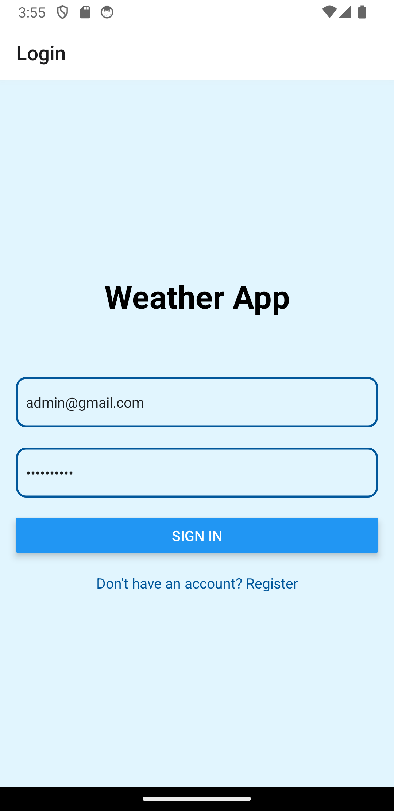
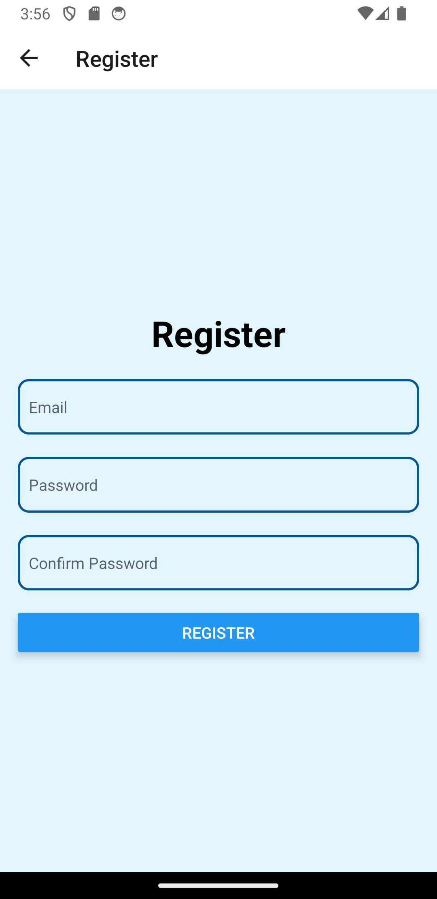
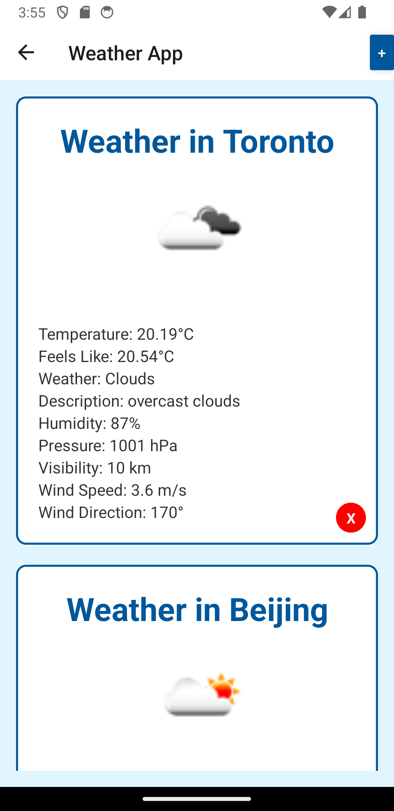

# Weather App

This is a simple React Native weather app. It allows you to check the current weather in different locations. You can add and delete locations, and it uses the OpenWeather API to fetch the weather data.

## Images

Here are some screenshots of the Weather App:

### Login Screen



### Register Screen



### Weather Screen



### Add Location Screen


## Prerequisites

Before you begin, ensure you have met the following requirements:

- You have installed the latest version of [Node.js and npm](https://nodejs.org/en/download/).
- You have a Windows/Linux/Mac machine.
- You have a running Android Virtual Device Manager (VDM). You can follow this [guide](https://developer.android.com/studio/run/managing-avds) on how to set up one.

## Installing Weather App

To install Weather App, follow these steps:

1. Clone the repository.
2. Navigate to the project directory.
3. Run `npm install` to install all the dependencies.

## Using Weather App

To use Weather App, follow these steps:

1. Make sure you have an Android Virtual Device running.
2. From the project directory, run `npm run android`.
3. Upon successful start, you'll see a login screen. Use `admin@gmail.com` and `adminadmin` to log in, or create a new account by clicking on 'Register'.

## Configuration
For security purposes, sensitive information like API keys and Firebase configuration are stored in a config.js file which is not included in the repository. You'll need to create your own config.js file in the root directory and replace the placeholders with your Firebase configuration and OpenWeather API key:

```
// config.js

export const firebaseConfig = {
  apiKey: "YOUR_API_KEY",
  authDomain: "YOUR_AUTH_DOMAIN",
  projectId: "YOUR_PROJECT_ID",
  storageBucket: "YOUR_STORAGE_BUCKET",
  messagingSenderId: "YOUR_MESSAGING_SENDER_ID",
  appId: "YOUR_APP_ID",
};

export const API_KEY = "YOUR_API_KEY";
```


## Contact

If you want to contact me, you can reach me at `mawangyang@live.com`.
